# Řezání vlastních návrhů ze SolidWorks/Fusion 360

Máš v SolidWorksu nebo ve Fusion vytvoření vlastní model určený k vyřezání na
laseru? Chceš aby tebou všechny krásně nakreslené zámečky do sebe přesně
zapadly? Zde je pro tebe návod.

Veškerý postup bude ukázán v SolidWorksu a Inkscapu, ale s drobnými obměnami by
měl jít použí i na Fusionu.

## Měření propalu laser

Abys mohl vyříznout zámečky, které do sebe skutečně pěkně a na fest zapadnou, je
třeba korigovat poloměr propalu laserového paprsku. Ten je zpravidla 0.1-0.2 mm.
Na většinu materiálů funguje korekce 0.15 mm.

Pokud ji ale chceš změřit, doporučuji si stáhnout soubor
[laserCaliber.svg](FabLab_Ze-SolidWorks-na-Laser.data/laserCaliber.svg) a ten na laseru vypálit. Jsou to
šablonky, na kterých je vždy pin o šírce 5mm a drážka o šířce 5 mm. V SVG je
jeich nekolik - každá s jinou korekcí (s krokem 5 setin milimetru). Jakmile máš
sadu 2x vypálenou, můžeš vyzkoušet, která dvojice s příslušnou korekcí do sebe
zapadá nejlépe. Šablonky také obsahují díru a průměru 3 mm, kterou můžeš
vyzkoušet vůči příslušné kulatině.

## Exportování modelu ze SolidWorksu

V SolidWorksu si vytvoř výkres o velikosti tvého materiálu, nastav mu měřítko
1:1 a naskládej na něj všechny díly, které chceš vyříznout. Existuje jeden dobrý
důvod, proč díly skládat do výkresu a neskládat je až v Inkscapu - pokud např.
změníš tloušťku  materiálu a zámečky se ti přeopočítají, nemusíš ručně skládat
díly znovu - aktualizace do výkresu proběhne automaticky.

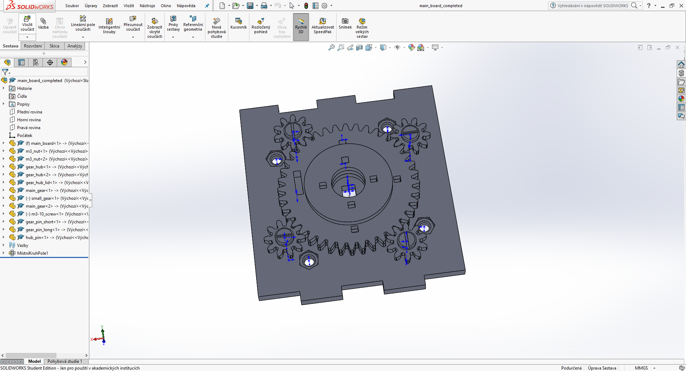
Vstupní model

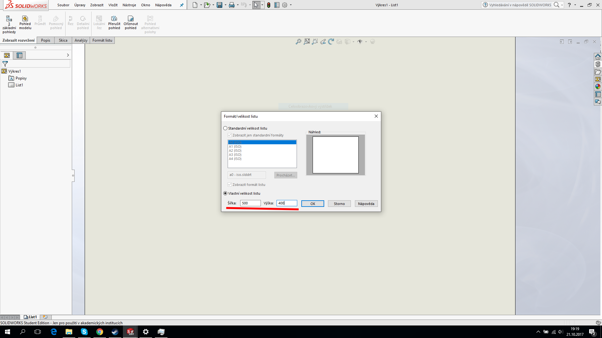
Nastavení rozměru výkresu

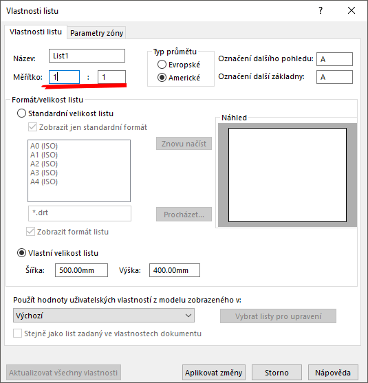
Ve vlastnostech výkresu změň měřítko na 1:1

 Při vkládání rotačních dílů, nezapomeň smazat symbol středu - jinak se vyřeže taky

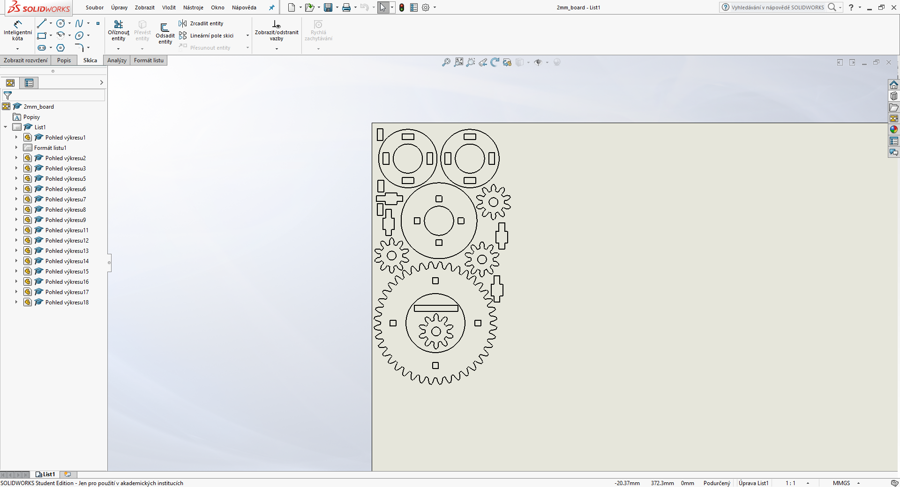
Ukázka naskládaných dílů

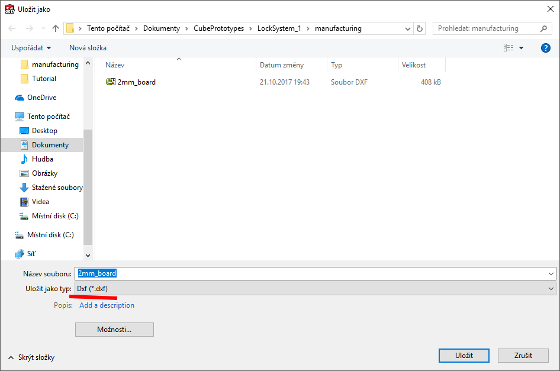
Ulož výkres jako DXF (a nezapomeň si uložit original!)

Jakmile máš výkres naskládaný, ulož je do formátu DXF. Při importu do Inkscapu
nezapomeň vybrat měřítko 1:1. Abys mohl aplikovat korekci propalu, je třeba dxf
ze SolidWorks "opravit". Formát DXF totiž pouze uchovává čáry a křivky, ale už
neuchovává informaci o tom, jak na sebe navazují. To zmenožňuje provést odsazení
kontur. Naštěstí je to jednoduché spravit.

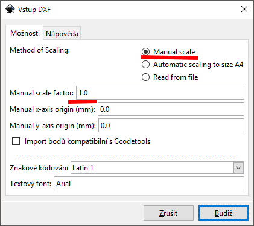
Při importu do Inkscape vyber scale factor 1

Prvně vyber všechno pomocí Ctrl+A, následně stiskni Ctrl+K, což seskupí všechny
entity do jedné křivky. Poté se přepni do módu úpravy křivek (F2) a znovu
stiskni Ctrl+A - to vybere tentokrát všechny body v křivce. Následně stiskni
Shift + J, což způsobí sloučení bodů, které leží přes sebe. Nyní si provizorně
nastav výplň tvarů - měly by se korektně vyplnit díly. Pokud některé díry zmizí,
přepni mód výplně na záložce výplně. Nyní Inkscape korektně ví, co jsou tvary,
které chceš řezat a ví tedy, kterým směrem je "dovnitř" a kterým "ven".

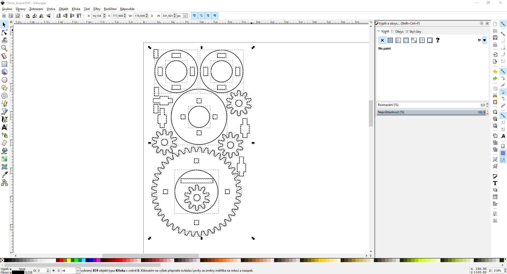
Importovaný výkres po stisku Ctrl + A - vše vybráno

Po stisku Ctrl + K se ze všeho stane 1 křivka

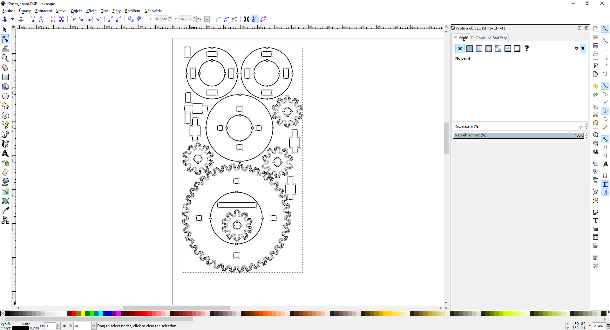
Po stisku F2 se přepneš do editace křivky

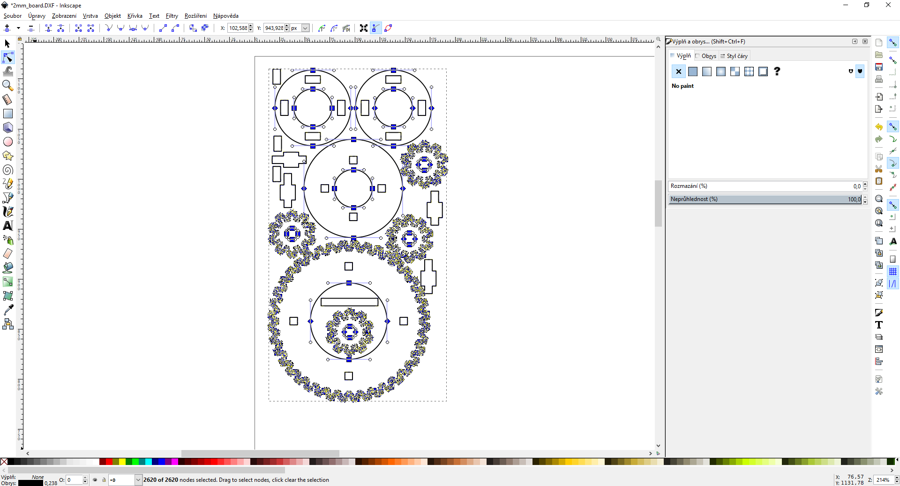
Po stisku Ctrl + A vybereš všechny body a Shift + J je sloučí překrývající se

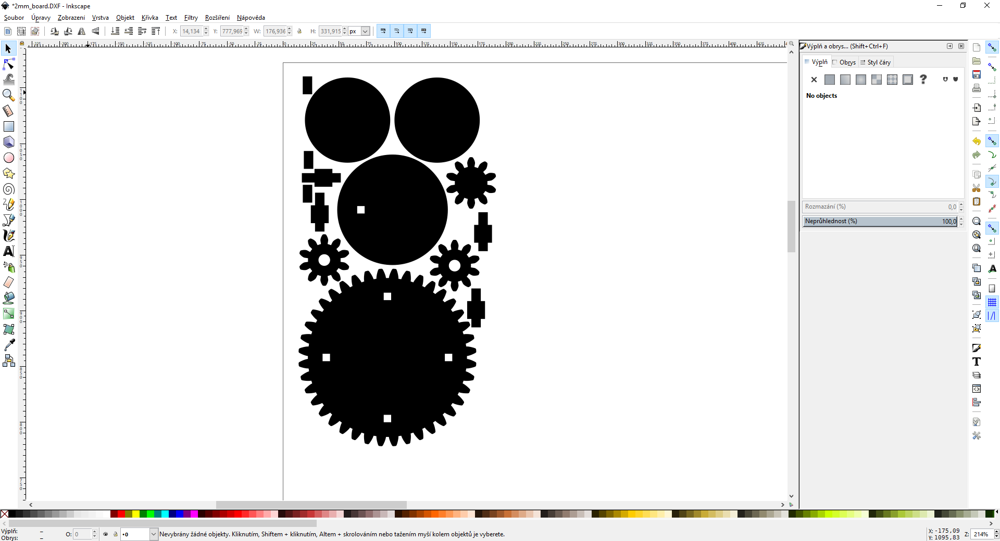
Zkušební nastavení výplně - je špatně

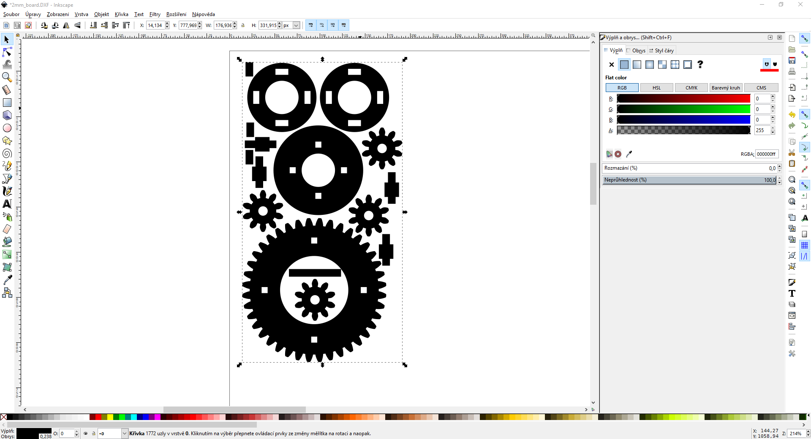
Opravení výplně tlačítkem vpravo

Nyní při výběru všeho stiskni Ctrl + J. To aktivuje mód dynamického odsazení.
Jak znáš z původního návodu k laseru, můžeš tažením za nově objevený bod
aplikovat korekci. Zkus to a zkontroluj, že všechny korekce se dějí, jak mají -
vnější rozměry se zvětšují, vnitřní se zmenšují. Pokud ne, v předchozím kroku se
stala chyba. Nyní dokument ulož jako SVG a otevři jej ve svém oblíbeném textovém
editoru - WordPad ani Word není textový editor. Vhodnými programy jsou např.
Poznámkový blok, PSPad, VS Code, Atom nebo VIM. Nyní najdi výskyt všech položek
"inkscape:radius=0.000" - to je hodnota korekce propalu - a nahraď ji za tebou
požadovou korekci v milimetrech - tedy např. "inkscape:radisu=0.15". Když
dokument uložíš a znovu otevřeš v Inkscapu, korekce správné velikosti bude
aplikována.

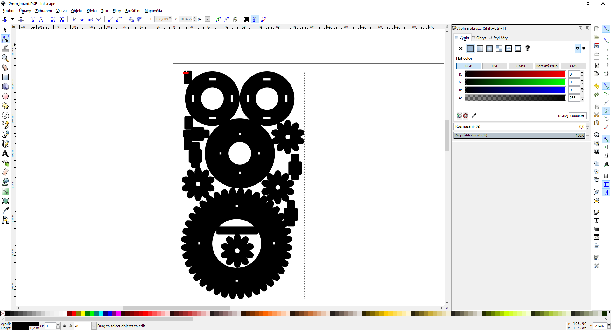
Po stisku Ctrl + J a tažením jsme ověřili správnost směru korekcí

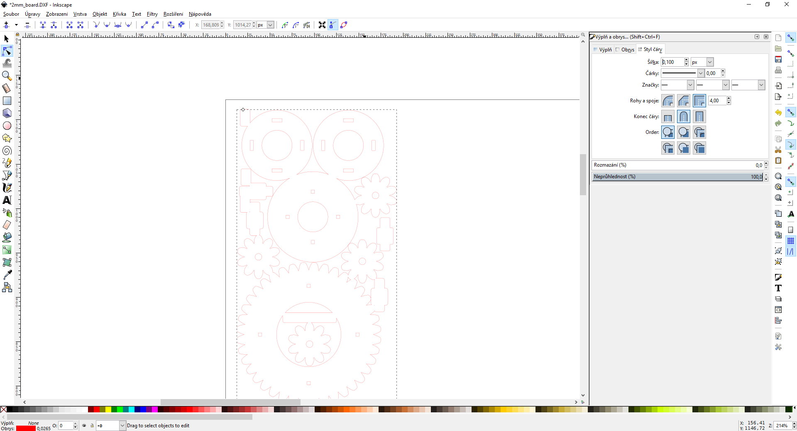
Nastavíme červenou tenkou čáru

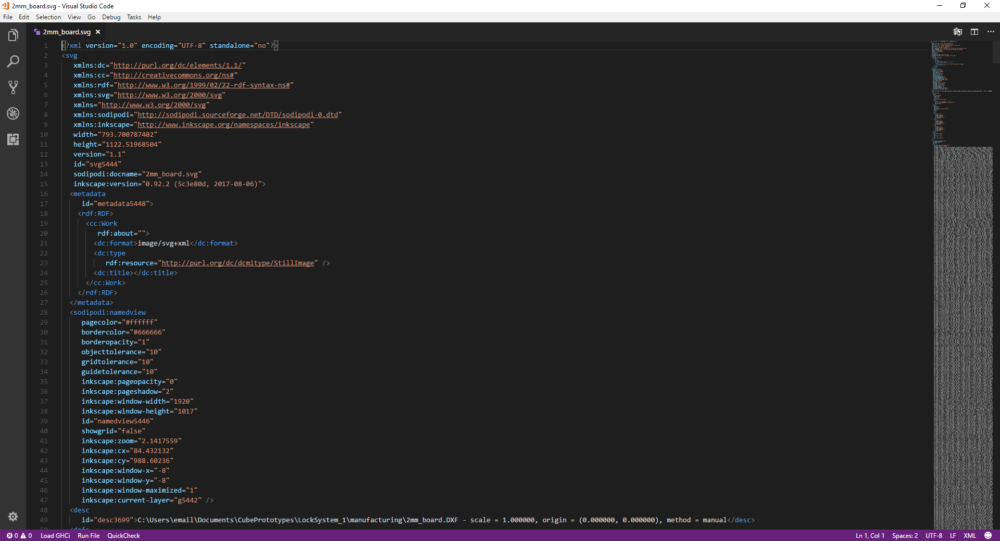
Otevřeme uložené SVG v textovém editoru

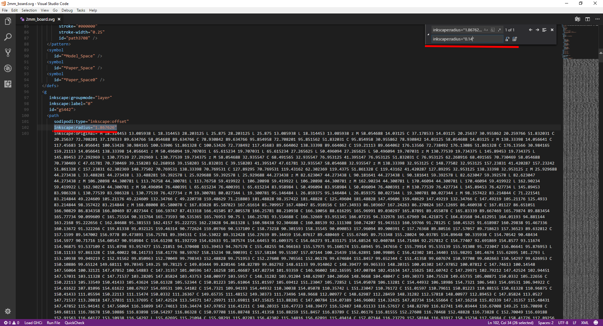
Provedme nahrazení řetězce pro korekci propalu

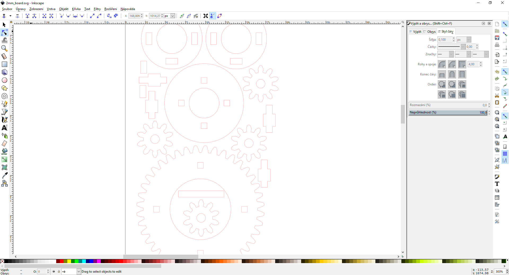
Znovu otevřený dokument v Inkscape se správnými korekcemi

A nyní hurá pálit!
